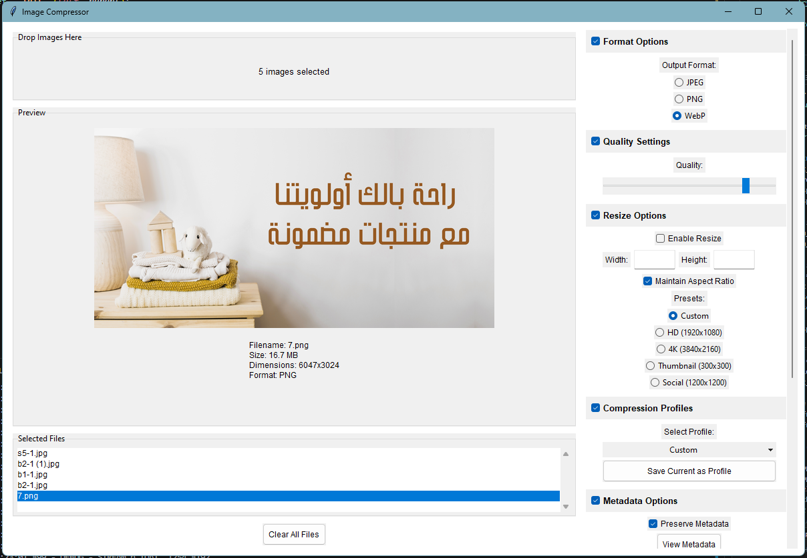

  
  <h1>Image Compressor Pro</h1>
  
A modern, user-friendly image compression tool with advanced features

## 🌟 Features

- **Modern UI**: Clean, Apple-inspired interface with collapsible sections
- **Drag & Drop**: Easy file handling with drag and drop support
- **Multiple Formats**: Support for JPEG, PNG, and WebP
- **Smart Compression**: Adjustable quality settings with live preview
- **Batch Processing**: Process multiple images at once
- **Resize Options**: 
  - Custom dimensions
  - Maintain aspect ratio
  - Preset sizes (HD, 4K, Social Media)
- **Metadata Control**: View and preserve image metadata
- **Batch Rename**: Smart file renaming with variables
- **Profile System**: Save and load compression settings
- **Live Preview**: See your images before compression
- **Progress Tracking**: Visual progress bar for batch operations

## 🖥️ Screenshots

  
  
<em>Modern, intuitive interface with live preview</em>

## 🚀 Quick Start

1. Download the latest release
2. Run ImageCompressor.exe
3. Drag and drop images or click to browse
4. Adjust settings as needed
5. Click "Compress Images" to process

## 💡 About

This project was built using AI with prompt engineering - no manual coding! It demonstrates the power of modern AI tools in creating professional software solutions.

## 👨‍💻 Developer

- **Name**: Mehdi Harzallah
- **Country**: Algeria 🇩🇿
- **Contact**:
  - WhatsApp: +213 778191078
  - GitHub: [@opestro](https://github.com/opestro)

## 🛠️ Technical Details

- Built with Python and Tkinter
- Modern UI/UX design
- Efficient image processing using Pillow
- Smart memory management
- Cross-platform compatibility

## 🎯 Use Cases

- Web optimization
- Social media preparation
- Photography workflow
- Batch image processing
- Storage optimization

## 📝 License

MIT License - feel free to use and modify!

## 🤝 Contributing

While this is an AI-generated project, suggestions and improvements are welcome! Feel free to:
1. Open issues
2. Suggest features
3. Share feedback

## ⭐ Star History

---

  
Built with AI 🤖 and Prompt Engineering by Mehdi Harzallah

  
No manual coding - just smart prompts and AI guidance!

 